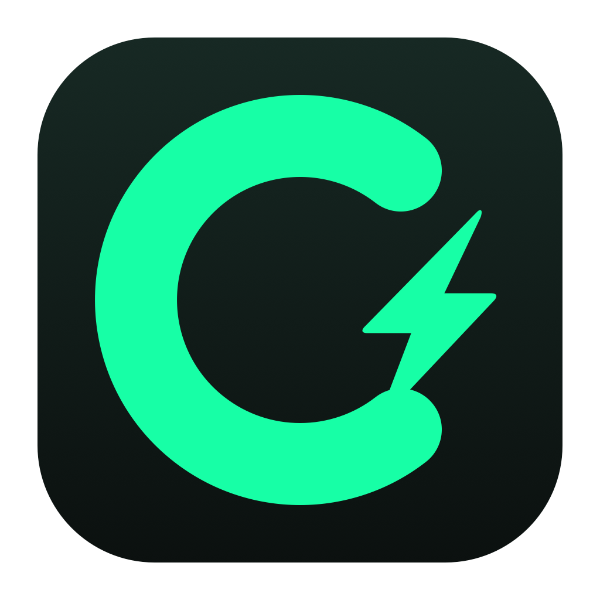
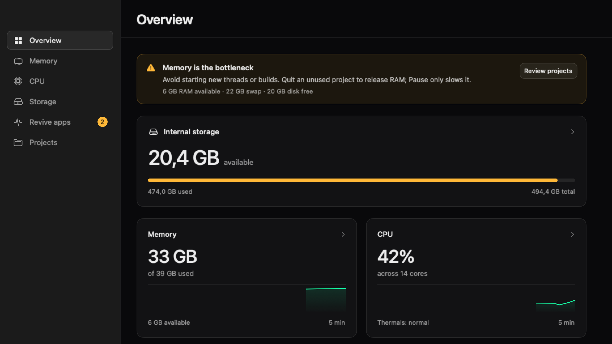
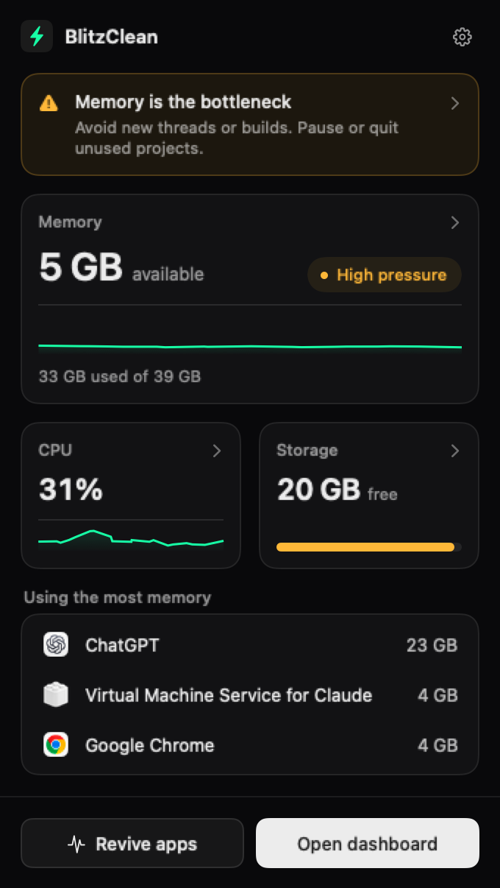

<p align="center"></p>
<h1 align="center">BlitzClean</h1>

<p align="center">
  See what is slowing your Mac down, and fix it from the menu bar.<br>
  An open-source resource monitor and careful storage cleaner, built by <a href="https://blitzreels.com">BlitzReels</a>.<br>
  Free on macOS 14 or later. No account, no subscription, no telemetry.
</p>

<p align="center">
  <a href="https://github.com/blitzreels/blitzclean/releases/latest">Download for macOS</a>
  · <a href="docs/FEATURES.md">Features</a>
  · <a href="docs/ARCHITECTURE.md">Architecture</a>
  · <a href="CONTRIBUTING.md">Contribute</a>
  · <a href="CHANGELOG.md">Release notes</a>
</p>

<p align="center">
  
  
  <a href="LICENSE"></a>
  <a href="https://github.com/blitzreels/blitzclean/actions/workflows/ci.yml"></a>
</p>



BlitzClean is for developers and creators whose Macs fill up with builds, caches, simulators, AI agents,
and dev servers. It shows CPU, memory, and free disk space in the menu bar, tells you which one is the
bottleneck, and gives you one window to act: quit or pause what is using memory, revive frozen apps,
and remove data that tools rebuild on their own.

Nothing leaves your Mac. Overview offers one-click cleanup of eligible rebuildable caches;
other removals are reviewed first, and personal files go to the Trash.

## What you can do

- Clean old, rebuildable caches from Overview with one click, with activity checks, animated progress,
  and a result showing removed cache bytes separately from the change in free disk space.
- See the limiting resource at a glance. The menu bar shows live numbers, and a warning names what is short
  (memory, swap, disk reserve, or CPU) with one instruction.
- Free memory by ranking apps and AI sessions such as Claude Code, Codex, and Cursor by RAM, then pausing,
  resuming, or quitting them. Whole projects can be stopped along with their dev servers.
- Inspect individual process footprints in Memory → Processes, sorted by RAM and searchable by name, owner,
  project path, or PID. Restricted measurements stay marked as unavailable.
- Revive apps that stopped or froze, and see whether each one actually recovered.
- Find what fills your disk by browsing every drive with folder sizes, or by ranking the largest files.
- Review caches, `node_modules`, build output, simulators, Docker, and merged worktrees before removing them,
  and see when removed folders grow back.
- Reduce supported System Data in Storage → Cleanup: eligible browser and developer caches, plus crash and
  hang reports older than 30 days. Reports require explicit selection and review.
- Filter large videos and images, find exact duplicates, and make smaller copies with FFmpeg.

<table>
  <tr>
    <td width="300" valign="top">
      
    </td>
    <td valign="top">
      <h3>Always in the menu bar</h3>
      <p>
        Memory, CPU, and storage at a glance, the apps using the most memory, and a warning only when
        something needs you. Closing the dashboard keeps monitoring on; quit from the panel's gear menu.
      </p>
      <p>
        Choose what the menu bar shows in Settings: available memory, used memory, or a percentage.
      </p>
    </td>
  </tr>
</table>

## Try it on your Mac

1. [Download the latest release][releases], unzip it, and move `BlitzClean.app` to Applications.
2. Open BlitzClean. It appears in the menu bar; click it and choose Open dashboard.
3. In Settings > Finish setup, allow the permissions you want:
   Notifications for warnings, Accessibility for frozen-window checks, Full Disk Access for protected folders.
   Every permission is optional, and the section disappears once all are granted.

Releases support Apple silicon and Intel Macs on macOS 14 or later.
Each download is Developer ID signed, notarized by Apple, and published with a SHA-256 checksum.

From 1.3.0, BlitzClean updates itself with [Sparkle](https://sparkle-project.org): it checks once a day,
downloads a signed update in the background, and offers Restart to update in the menu bar panel and Settings.
Version 1.2.0 and earlier have no updater; download 1.3.0 once by hand and later versions arrive automatically.

## Safety

- Scans never delete anything. Overview's Clean button explicitly removes all eligible known caches;
  Storage offers individual selection and inline review for other removals.
- Personal files and folders go to the Trash. BlitzClean never empties the Trash for you.
- Rebuildable data (caches, dependencies, build output) and explicitly reviewed old diagnostic reports can
  be permanently deleted. Dependencies, build output, and reports keep their separate review flows.
- Running tools, open files, recent changes, and protected paths block removal.
- Process identity is checked again right before Quit, Pause, or Force Quit.
  Force Quit and bulk actions always ask first; nothing is force-quit automatically.
- No memory purge commands, no synthetic memory pressure, no background deletion.

The full rules are in [Features → Removal and process rules](docs/FEATURES.md#removal-and-process-rules).

## Privacy

BlitzClean runs entirely on your Mac: no account, cloud service, analytics, or telemetry SDK.
The only network request is the daily update check, which fetches the release feed from GitHub and sends the
app's version in its user agent. Turn it off in Settings > Updates.
Charts, scan results, and the removal log stay in `~/Library/Application Support/BlitzClean`, each with a size limit.
Saved history never includes conversation contents, window text, environment variables, or process arguments.
See [Privacy and permissions](docs/PRIVACY.md) for exactly what is read and stored.

## Build from source

Requires macOS 14+ and a Swift 6 toolchain (Xcode 16 or later).

```sh
git clone https://github.com/blitzreels/blitzclean.git
cd blitzclean
./script/build_and_run.sh
```

This builds, installs, and opens `~/Applications/BlitzClean.app`, signed with your Apple Development identity
so macOS permissions stay attached between builds. Without a signing identity, use an ad-hoc build:

```sh
BLITZCLEAN_SIGNING_IDENTITY=- ./script/build_and_run.sh
```

Ad-hoc rebuilds can ask for permissions again. They are for local development, not distribution.

### Checks

```sh
./scripts/check.sh        # build, tests, swift-format lint, plist and shell checks
./scripts/build-app.sh    # package the app bundle
BLITZCLEAN_DESIGN_DIR=/tmp/shots swift test --filter DesignRenderTests   # render every screen
```

Media tests need FFmpeg (`brew install ffmpeg`).
See [Releasing](docs/RELEASING.md) for universal packaging, signing, notarization, and checksums.

## Repository map

| Path | What lives there |
| --- | --- |
| [Sources/BlitzClean](Sources/BlitzClean) | The app: monitoring, memory and process control, storage scans, cleanup, and UI |
| [Tests/BlitzCleanTests](Tests/BlitzCleanTests) | Unit, integration, and screenshot render tests |
| [docs](docs) | [Features](docs/FEATURES.md), [architecture](docs/ARCHITECTURE.md), [design rules](docs/DESIGN.md), [privacy](docs/PRIVACY.md), [releasing](docs/RELEASING.md), [roadmap](docs/ROADMAP.md) |
| [script](script), [scripts](scripts) | Build-and-run, checks, packaging, and release scripts |
| [support](support) | `Info.plist` and entitlements |
| [assets](assets) | App icon and brand files |

## Contribute

Bug reports, focused fixes, and documentation improvements are welcome.
Read [CONTRIBUTING.md](CONTRIBUTING.md), and open an issue before starting a larger change.

Use [GitHub Issues][issues] for reproducible bugs and feature requests.
Report security problems privately as described in [SECURITY.md](SECURITY.md).

## License

BlitzClean is available under the [MIT License](LICENSE).
Projects that shaped it are credited in [open-source bases](OPEN_SOURCE_BASES.md).

<p align="center">
  <a href="https://blitzreels.com?utm_source=github&utm_medium=readme&utm_campaign=blitzclean-oss">
    <picture>
      <source media="(prefers-color-scheme: dark)" srcset=".github/assets/readme/blitzreels-logo-white.png">
      
    </picture>
  </a>
</p>

[releases]: https://github.com/blitzreels/blitzclean/releases/latest
[issues]: https://github.com/blitzreels/blitzclean/issues
